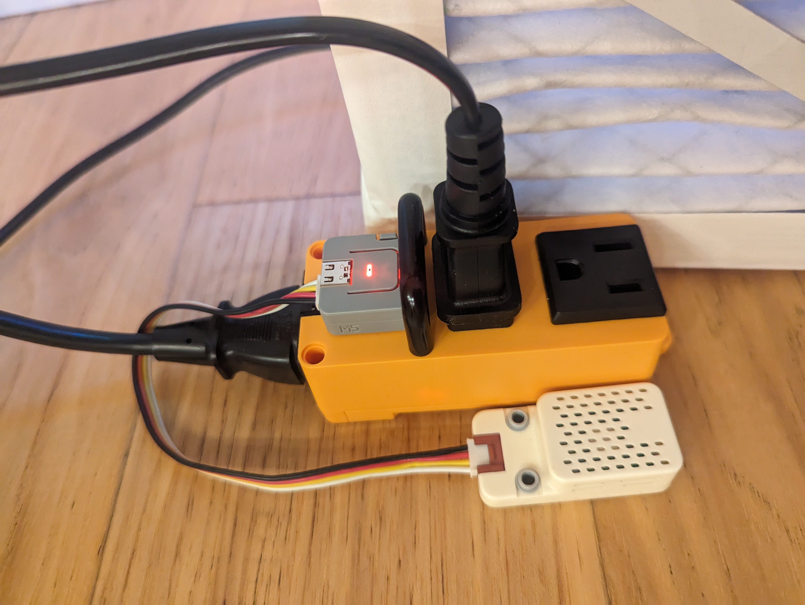

# IAQSwitch
This is a simple weekend or classroom project to build a simple on/off switch that response to a Co2 sensor reading. Could be used to toggle power to an air filter or ventilation fan in response to Co2 readings. Lower threhsholds can be used to detect occupancy. Higher thresholds may be better for louder filters or to preserve power.

Both the [UiFlow](https://flow.m5stack.com/) (Blockly) and generated MicroPython files are included. Could be used for learning about IAQ or as a starter project for programming/robotics. Other sensors could easily be substituted.

## Hardware
* [Atom Socket Kit](https://shop.m5stack.com/products/atom-socket-kit-hlw8023-jp-us)
* [Unit Co2](https://docs.m5stack.com/en/unit/co2)

## Images

